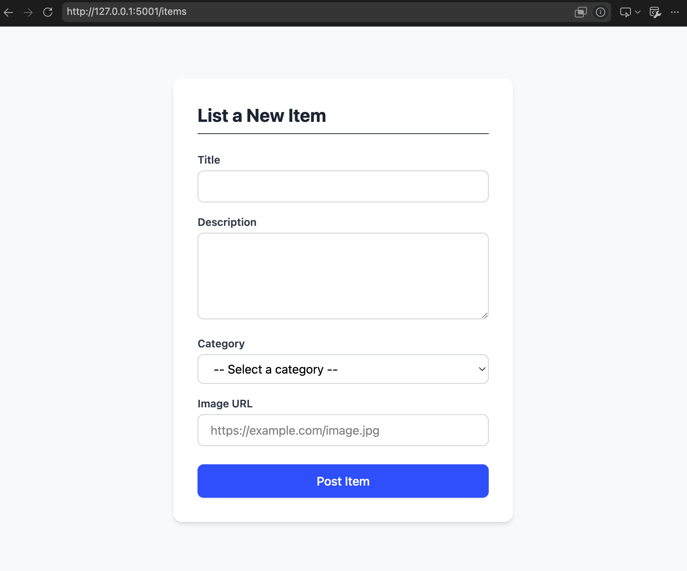

# Week 2: Introducing AI Tools

**Date:** 28 June 2026

---

## What we're covering today

* Refresh of Week 2
* Homework Review
* HTML Form Element
* AI Tools (Claude, Gemini)

---

## Refresh of Request-Response Model (from Week 2)

(See Week 2 handout)

---

## Homework Review: User Stories

(See `user_stories.md`)

* Review of comments
* Additional user stories
* User journey

### User Stories: Campus Lost-and-Found & Trading Platform

#### Core Identity & Authentication
* **Registration & Login:** As a campus user, I want to register for an account and log in securely so that I can participate in the platform safely.
* **Authorship:** As a logged-in user, I want my username to be displayed on the items I post so that others know who listed them.

#### Posting & Browsing Items
* **Posting Items:** As a logged-in user, I want to post an item with a title, description, and category so that I can report a lost item or offer something for trade.
* **Adding Images:** As a logged-in user, I want to include an image when posting an item so that others can see exactly what the item looks like.
* **Browsing:** As a user, I want to view a feed of available campus items so that I can see what has been lost or is up for trade.

#### Search & Discovery
* **Text Search:** As a user, I want to search for items using keywords so that I can quickly find a specific lost item or trade.
* **Category Filtering:** As a user, I want to filter the feed by specific categories so that I can narrow down the items to what is relevant to me.
* **Combined Search:** As a user, I want to use text search and category filters simultaneously so that I can perform highly specific searches.

#### Item Claiming & State Management
* **Item Detail:** As a user, I want to click on an item to view its full details and image so that I can determine if it is the item I am looking for.
* **Claiming:** As a logged-in user, I want to claim an item that belongs to someone else so that I can arrange to retrieve my lost property or complete a trade.
* **Status Updates:** As a user browsing the site, I want items to clearly show whether they are "available" or "claimed" so that I do not waste time looking at unavailable items.

#### Incentives & Gamification
* **Earning Points:** As an active user, I want to automatically earn points for helpful actions like posting and claiming items so that my contributions to the campus community are recognized.
* **Leaderboard:** As a competitive user, I want to see a leaderboard ranking the users with the most points so that I am motivated to keep using the platform.
* **Profile History:** As a user, I want to view my profile page and see a complete history of the points I have earned so that I can track my engagement over time.

---

## HTML Form

Today, we are going to start some development!

For your Lost-and-Found/Second-Hand Trading app, a user will need to be able to list an item. They will need a form!

> **What would your form look like? What information would you need?**

### Implementing our form HTML

Before we start,
* In `/templates` subdirectory, create a new HTML file `list_item_form.html`
* Make a copy of the following HTML code:

```html
<!DOCTYPE html>
<html lang="en-US">
  <head>
    <meta charset="utf-8">
    <meta name="viewport" content="width=device-width">
    <title>Post an Item</title>
  </head>
  <body>
    <p>This is my page</p>
  </body>
</html>
```

#### The <form> element

All forms start with a <form> element, like this:

```html
<form action="/items" method="POST">…</form>
```

(From [webmd](https://developer.mozilla.org/en-US/docs/Learn_web_development/Extensions/Forms/Your_first_form))
This element formally defines a form. It's a container element like a <section> or <footer> element, but specifically for containing forms; it also supports some specific attributes to configure the way the form behaves. All of its attributes are optional, but it's standard practice to always set at least the action and method attributes:

* The action attribute defines the location (URL) where the form's collected data should be sent when it is submitted.
* The method attribute defines which HTTP method to send the data with (usually get or post).

For now, add the above `<form>` element into your HTML `<body>`.


#### The `<label>`, `<input>`, `<textarea>` and `<select>` elements

[Example Form](https://tailwindcss.com/plus/ui-blocks/application-ui/forms/form-layouts)

```html
<form action="/items" method="POST" id="post-item-form">

    <div>
        <label for="title">Title:</label><br>
        <input type="text" id="title" name="title" required>
    </div>
    <br>

    <div>
        <label for="description">Description:</label><br>
        <textarea id="description" name="description" rows="4" cols="50" required></textarea>
    </div>
    <br>

    <div>
        <label for="category">Category:</label><br>
        <select id="category" name="category" required>
            <option value="">-- Select a category --</option>
            <option value="lost">Lost</option>
            <option value="found">Found</option>
            <option value="trade">Trade</option>
        </select>
    </div>
    <br>

    <div>
        <label for="image_url">Image URL (to be changed):</label><br>
        <input type="url" id="image_url" name="image_url" placeholder="https://example.com/image.jpg">
    </div>
    <br>

    <button type="submit">Post Item</button>

</form>
```

#### Add styling

To add styling, we can use [Tailwind CSS](https://tailwindcss.com/), which is a CSS Framework that makes use of in-line styling (as opposed to using a separate css file).

Update your `list_item_form.html` to the following:
```html
<!DOCTYPE html>
<html lang="en">
<head>
    <meta charset="UTF-8">
    <meta name="viewport" content="width=device-width, initial-scale=1.0">
    <title>Post an Item</title>
    <script src="https://cdn.jsdelivr.net/npm/@tailwindcss/browser@4"></script>
</head>
<body class="bg-gray-50 flex items-center justify-center min-h-screen p-6">

    <div class="bg-white p-8 rounded-xl shadow-md w-full max-w-md">
        <h2 class="text-2xl font-bold text-gray-800 mb-6 border-b pb-2">List a New Item</h2>

        <form action="/items" method="POST" id="post-item-form" class="space-y-4">

            <div>
                <label for="title" class="block text-sm font-semibold text-gray-700 mb-1">Title</label>
                <input type="text" id="title" name="title" required
                       class="w-full px-4 py-2 border border-gray-300 rounded-lg focus:ring-2 focus:ring-blue-500 focus:outline-none transition">
            </div>

            <div>
                <label for="description" class="block text-sm font-semibold text-gray-700 mb-1">Description</label>
                <textarea id="description" name="description" rows="4" required
                          class="w-full px-4 py-2 border border-gray-300 rounded-lg focus:ring-2 focus:ring-blue-500 focus:outline-none transition"></textarea>
            </div>

            <div>
                <label for="category" class="block text-sm font-semibold text-gray-700 mb-1">Category</label>
                <select id="category" name="category" required
                        class="w-full px-4 py-2 border border-gray-300 rounded-lg bg-white focus:ring-2 focus:ring-blue-500 focus:outline-none transition">
                    <option value="">-- Select a category --</option>
                    <option value="lost">Lost</option>
                    <option value="found">Found</option>
                    <option value="trade">Trade</option>
                </select>
            </div>

            <div>
                <label for="image_url" class="block text-sm font-semibold text-gray-700 mb-1">Image URL (to be changed)</label>
                <input type="url" id="image_url" name="image_url" placeholder="https://example.com/image.jpg"
                       class="w-full px-4 py-2 border border-gray-300 rounded-lg focus:ring-2 focus:ring-blue-500 focus:outline-none transition">
            </div>

            <button type="submit"
                    class="w-full bg-blue-600 hover:bg-blue-700 text-white font-medium py-2.5 px-4 rounded-lg shadow transition duration-200 mt-2 cursor-pointer">
                Post Item
            </button>

        </form>
    </div>

</body>
</html>
```

#### Viewing your form

To view your form, we want to create a new route to your app:

**app.py**
```python
@app.route('/post-item', methods=['GET'])
def list_items():
    return render_template('list_item_form.html')
```

With your venv activated, run `python app.py` and go to `http://127.0.0.1:5001/items`.




#### Sending form data to your web server

[From mdn](https://developer.mozilla.org/en-US/docs/Learn_web_development/Extensions/Forms/Your_first_form)

The last part, and perhaps the trickiest, is to handle form data on the server side. The <form> element defines where and how to send the data thanks to the action and method attributes.

We provide a name attribute for each form control. The names are important on both the client- and server-side; they tell the browser which name to give each piece of data and, on the server side, they let the server handle each piece of data by name. The form data is sent to the server as name/value pairs.

To name the data in a form, you need to use the name attribute on each form widget that will collect a specific piece of data. Let's look at some of our form code again:


```html
<form action="/items" method="POST" id="post-item-form">

    <div>
        <label for="title">Title:</label><br>
        <input type="text" id="title" name="title" required>
    </div>
    <br>

    <div>
        <label for="description">Description:</label><br>
        <textarea id="description" name="description" rows="4" cols="50" required></textarea>
    </div>
    <br>

    <div>
        <label for="category">Category:</label><br>
        <select id="category" name="category" required>
            <option value="">-- Select a category --</option>
            <option value="lost">Lost</option>
            <option value="found">Found</option>
            <option value="trade">Trade</option>
        </select>
    </div>
    <br>

    <div>
        <label for="image_url">Image URL (to be changed):</label><br>
        <input type="url" id="image_url" name="image_url" placeholder="https://example.com/image.jpg">
    </div>
    <br>

    <button type="submit">Post Item</button>

</form>
```

To your `app.py`, specify a route for the data to get submitted to:

```python
@app.route('/items', methods=['POST'])
def handle_item_submission():
    # Capture form data (or handle file upload)
    title = request.form.get('title')
    description = request.form.get('description')
    category = request.form.get('category')
    image_url = request.form.get('image_url')

    return jsonify({"status": "success", "message": "Item received!"})
```
Now try submitting some information in your form.


# AI Tools (Claude, Gemini)

There are many AI tools out there today, but personally I feel that Claude is the most relevant to and used by developers today. AI tools are very powerful and can set up your entire project for you. But it is still important to know the fundamentals of full-stack development so that you are equipped to 1) prompt effectively and 2) ensure that AI generated output is what you actually want.

## Types
### Claude

* Web
* Claude Code

### Gemini

* Web
* [AI Studio](https://aistudio.google.com/prompts/new_chat)

## How to prompt effectively

[Claude Platform Docs](https://platform.claude.com/docs/en/build-with-claude/prompt-engineering/claude-prompting-best-practices)

* Be clear with what you want it to achieve (what is the output? what is NOT what you want?)
* Give context behind your request ("I want to do X because Y")
* Optionally prompt it to ask you clarifying questions at the end of your prompt (e.g. 'Please ask any clarifying questions before proceeding.')
* Upload relevant files for reference


## Usage in Class

* We will start by prompting and manually copying the output from the chat into our repository. We will still continue learning concepts in the classes so that you can understand the principles behind development. You will have to understand and explain the code before it gets committed. We are not trying to merely be vibe coders (though that can be fun).

* In the later weeks, we can make use of Claude Code that will be integrated into the repository to speed up the process.
