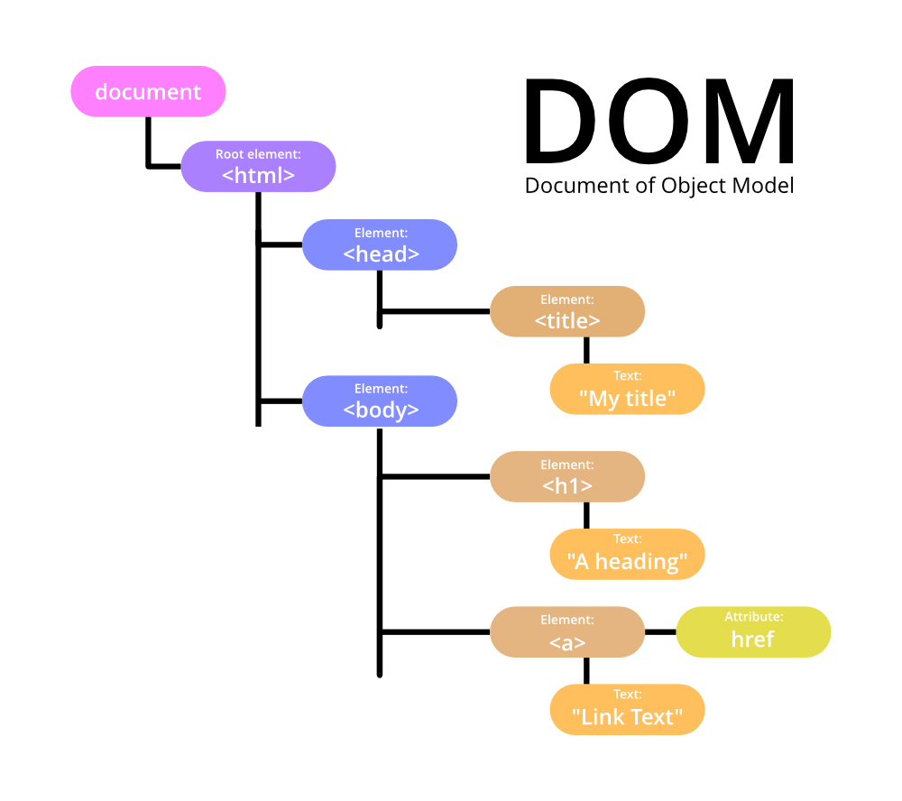

# Week 4: Javascript Fundamentals

**Date:** 5 July 2026


## What we're covering today

* [Javascript Fundamentals](#javascript-fundamentals)
* [Browser: Document, Events, Interfaces](#browser-document-events-interfaces)
* [Promises, async/await](#promises-asyncawait)
* [Hands-On](#promises-asyncawait)
* [Homework](#homework)


## Javascript Fundamentals

Let's take a look at some tutorials below for reference on getting started with the Javascript language:

Hello World
https://javascript.info/hello-world

Code structure
https://javascript.info/structure

Use strict
https://javascript.info/strict-mode

Variables
https://javascript.info/variables

Data Types
https://javascript.info/types

Function Basics
https://javascript.info/function-basics

Arrow functions basics
https://javascript.info/arrow-functions-basics

JSON
https://javascript.info/json

I would highly recommend looking through other sections of this roadmap as it is well structured and informative on Javascript:)


## Browser: Document, Events, Interfaces

Now, let's see how Javascript is used in our browsers!

Document
https://javascript.info/document



*Other references:* https://developer.mozilla.org/en-US/docs/Web/API/Document_Object_Model

Introduction to Events
https://javascript.info/introduction-browser-events

> **Exercise**
> Let's try to add an alert for when a user clicks the "Submit" button in one of your forms.


## Promises, async/await

As we will need to get data from external sources (e.g. a database), we will need to learn how to fetch and handle them properly:

https://javascript.info/async


## Hands-On

#### 1. Update `templates/index.html`
Let's create a mock landing page:
```html
<!DOCTYPE html>
<html lang="en">
<head>
    <meta charset="UTF-8">
    <title>Lost and Found</title>
    <link rel="stylesheet" href="{{ url_for('static', filename='style.css') }}">
</head>
<body>
    <h1>Lost and Found Items</h1>
    <p id="loading">Loading...</p>
    <div id="items-container"></div>

    <script src="{{ url_for('static', filename='script.js') }}"></script>
</body>
</html>
```

#### 2. Add a new file `static/script.js`
We need a Javascript script to fetch data for our landing page.
```js
const loadingEl = document.querySelector("#loading");
const containerEl = document.querySelector("#items-container");

async function loadItems() {
    loadingEl.style.display = "block";

    try {
        const response = await fetch("/items");
        const items = await response.json();

        containerEl.innerHTML = "";
        items.forEach(item => {
            const card = document.createElement("div");
            card.classList.add("item-card");

            const title = document.createElement("h3");
            title.textContent = item.name;

            const location = document.createElement("p");
            location.textContent = item.location;

            card.appendChild(title);
            card.appendChild(location);
            containerEl.appendChild(card);
        });
    } catch (error) {
        containerEl.innerHTML = "<p>Something went wrong loading items.</p>";
    } finally {
        loadingEl.style.display = "none";
    }
}

loadItems();
```

#### 3. Add route in `app.py`
We need to add a `GET` route to simulate an endpoint to fetch your items data. In the actual project, we will set up a database and fetch information from there instead.

```python
@app.route('/items', methods=['GET'])
def get_items():
    ITEMS = [
        {"id": 1, "name": "Blue Water Bottle", "location": "Library, 2nd floor"},
        {"id": 2, "name": "Black Umbrella", "location": "Main Hall entrance"},
        {"id": 3, "name": "Calculator (Casio)", "location": "Maths block, Room 4"},
    ]
    return jsonify(ITEMS)
```

Notice that we can use `/items` twice (once as a `GET` and once as a `POST`). Flask will work normally as long as we use two different method names (i.e. `get_items()` vs `handle_item_submission()`). Otherwise, we will get the following error in the terminal:
```
AssertionError: View function mapping is overwriting an existing endpoint function: handle_item_submission
```

#### Now run `python app.py` and open `http://127.0.0.1:5001/` in your browser.
What do you think you are going to see?


## Homework

- [ ] Update the relevant files so that the landing page shows the items meant to be listed in a proper way. `ITEMS` in `app.py` should reflect the actual data fields that you are displaying about your items. This is so that it will be a smoother transition when we go into databases next week.
- [ ] Try this user story: *As a user, I want to click on an item to view its full details and image so that I can determine if it is the item I am looking for.* What functions would you need to implement for this to work?
